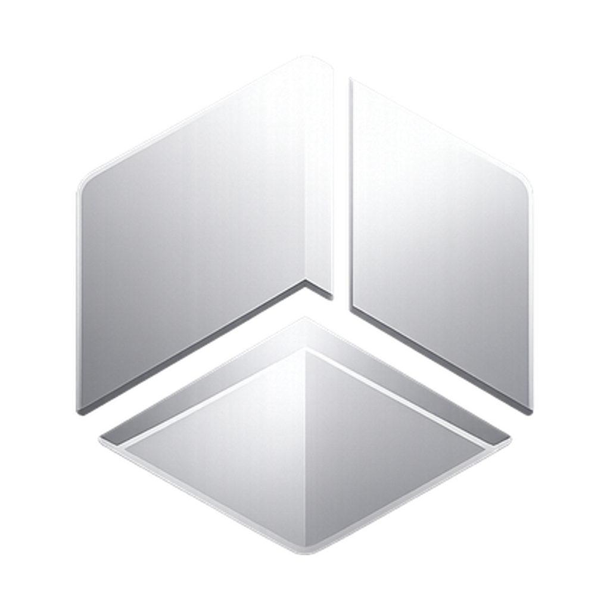

<div align="center">



# TokenMaxxing

**Your AI coding, quantified — and ranked.**

A local-first desktop app that turns how you use AI coding tools into beautiful
analytics — tokens, sessions, coding hours, spend, streaks, a live global
leaderboard, and an annual **AI Wrapped**. Contribution graphs meet a
year-in-review, for developers who build with AI.

Works with **Claude Code · Cursor · Codex** (Gemini, Aider, Cline & Roo
auto-detected). **Your code never leaves your machine.**

[**⬇ Download**](https://github.com/Launch-Craft/TokenMaxxing-Desktop/releases/latest) ·
[Report a bug](https://github.com/Launch-Craft/TokenMaxxing-Desktop/issues) ·
Crafted by [**Launchcraft Studio**](https://launchcraft.studio)


</div>

---

> **This is the desktop application** — one of three TokenMaxxing repos (this app,
> the backend API, and the marketing website). It runs fully offline with
> on-device estimates; set `VITE_API_BASE_URL` to light up the cloud leaderboard,
> shipping globe, and sign-in.

## ⬇ Download

Grab the latest build from the
[**Releases**](https://github.com/Launch-Craft/TokenMaxxing-Desktop/releases/latest)
page (macOS · Apple Silicon). On first launch, grant read access to your AI tool
directories — TokenMaxxing scans them locally and surfaces your stats in seconds.

## ✨ Features

- **Dashboard** — tokens today/this month, active sessions, coding hours, global
  rank, current streak, a token-usage chart (daily/weekly/monthly/yearly), a tool
  breakdown donut, and recent sessions.
- **Analytics** — a GitHub-style contribution heatmap, monthly tokens by tool,
  top projects, and models used.
- **Sessions** — searchable, filterable, sortable history of every AI session.
- **Rankings + shipping globe** — global / country / tool ranks, a leaderboard
  that recomputes every minute, and a 3D globe of where developers ship tokens
  from (on-device estimate by default; opt in to compare globally).
- **AI Wrapped** — a shareable, exportable (PNG) year-in-review.
- **Estimated AI spend** — what your usage would cost at public per-model API
  pricing. Input / output / cache-read / cache-write are priced separately per
  model (`src/shared/pricing.ts`), so Claude's cheap cache reads aren't
  over-counted.
- **macOS menu-bar tray** — today's tokens live in the status bar; click for
  tokens, rank, spend, and quick actions.
- **Privacy controls** — disable cloud sync, export everything, delete all data.

## 🛠 Tech stack

| Layer    | Choice                                                    |
| -------- | -------------------------------------------------------- |
| Desktop  | Electron + electron-vite                                 |
| UI       | React + TypeScript + Tailwind + shadcn/ui + Framer Motion |
| Charts   | Recharts (+ custom SVG heatmap / globe / sparklines)    |
| State    | Zustand                                                  |
| Local DB | SQLite (better-sqlite3) with a JSON fallback            |
| Cloud    | Separate backend (Express + Supabase) — URL only        |

## 🔒 Privacy by design

- **Never** uploads source code, prompts, or conversations.
- All scanning happens locally; adapters return only **aggregated counts**.
- Cloud sync is **off by default** — with it off, nothing leaves the device.
- One-click **export** and **delete-all**.

## 🧩 Scanner & adapter pattern

Each tool has an adapter returning `{ toolName, sessionCount, estimatedTokens,
activeHours, projectCount, … }`. Token counts are **exact** where the tool
records them (Claude Code's `usage`) and **clearly-labeled estimates** otherwise.

```
ToolAdapter (abstract)
├── ClaudeAdapter        ~/.claude/projects/**.jsonl   (exact usage)
├── CursorAdapter        ~/.cursor/ai-tracking/*.db    (SQLite via sql.js/WASM — no native build)
├── CodexAdapter         ~/.codex/**.jsonl             (real token usage, byte-estimate fallback)
└── LogDirectoryAdapter  (byte-density estimate)
    ├── AiderAdapter     ~/.aider
    ├── GeminiAdapter    ~/.gemini            (auto-detect)
    ├── ClineAdapter     editor globalStorage (auto-detect)
    └── RooCodeAdapter   editor globalStorage (auto-detect)
```

Add a tool by subclassing `ToolAdapter` and registering it in
`src/main/scanner/adapters/index.ts` — the dashboard, rankings, and achievements
pick it up automatically.

### Incremental scanning (compute the past once)

Each adapter enumerates its sources with a cheap content **fingerprint**
(`size:mtime`). The base compares fingerprints to stored `scan_checkpoints`;
**only new or changed sources are parsed**, everything else is reused from
SQLite. Historical conversations are computed exactly once.

```
First scan:  287 sources parsed · 0 cached   → ~1.3 s
Next scan:     0 sources parsed · 287 cached → ~20 ms   (same totals)
```

Once signed in, an incremental pass runs continuously (every 2s) so the
dashboard stays live — warm passes are near no-ops.

## 📁 Project structure

```
src/
├── shared/      types · ipc contract · achievements · ranking · constants
├── main/        Electron main: window, db (SQLite), scanner, services, ipc
├── preload/     contextBridge → window.api
└── renderer/    React app: pages, components, charts, stores, lib
```

The cloud API (rankings, leaderboard, OAuth, Supabase) is a **separate service**
— the app only needs its URL via `VITE_API_BASE_URL`.

## 🚀 Development

```bash
git clone https://github.com/Launch-Craft/TokenMaxxing-Desktop.git
cd TokenMaxxing-Desktop
npm install            # installs deps + rebuilds better-sqlite3 for Electron
npm run dev            # launch the app with HMR
npm run typecheck      # tsc for main + renderer
npm run build          # bundle main/preload/renderer
npm run dist           # package installers (electron-builder)
```

> **Preview in a browser:** the renderer runs standalone with rich demo data when
> `window.api` is absent — handy for design iteration.

### Native module note

`better-sqlite3` is a native module. `postinstall` rebuilds it against Electron's
ABI. If that ever fails, the app **still boots** — it transparently falls back to
a JSON-file-backed store. Re-run `npm run rebuild` to restore SQLite.

## ☁️ Cloud backend (optional)

The app talks to the dedicated backend service over HTTP. Set `VITE_API_BASE_URL`
in `.env` to enable rankings sync, the leaderboard/globe, and OAuth sign-in.
**Supabase keys and OAuth client secrets live in the backend, not here** — the
desktop app never holds them. Without a backend URL the app runs fully offline
with on-device estimates.

## 📄 License

MIT © [Launchcraft Studio](https://launchcraft.studio)
